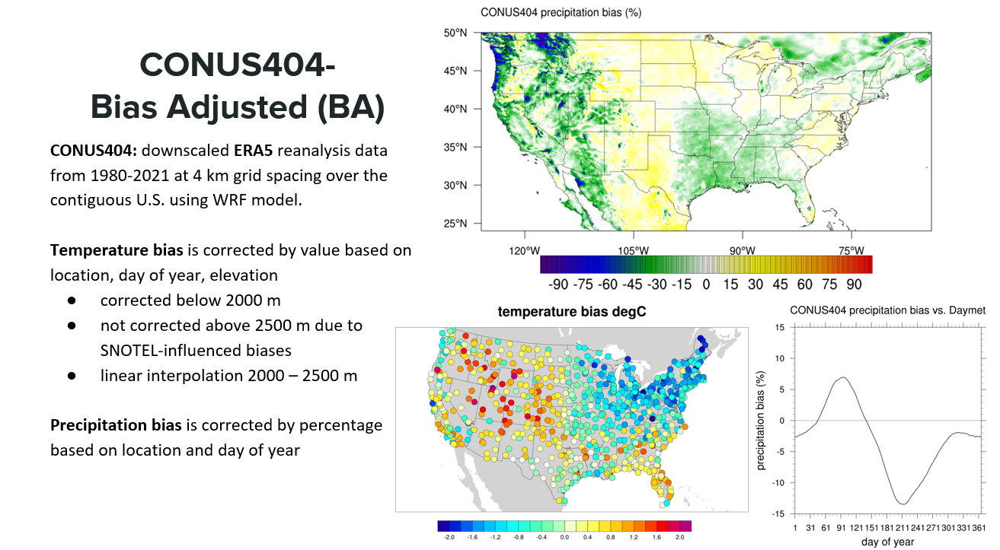

# Aggregating the WRF-Hydro Modeling Application output to twelve-digit hydrologic unit codes (HUC12s)
**Workflow Authors:** Kevin Sampson and Aubrey Dugger at NSF National Center for Atmospheric Research (NCAR)

This workflow is a combination of shell scripts (.sh) and jupyter notebooks (.ipynb) that aggregate key variables from the 10-year WRF-Hydro Modeling Application forced with CONUS404-BA to the contiguous United States (CONUS) water boundary dataset (WBD) HUC12s for the years 2010-2021. Additional steps are included in this workflow that prepare the data for publication and make the outputs comparable to the [National Hydrologic Model/Precipitation-Runoff Modeling System (NHM/PRMS)](https://www.usgs.gov/mission-areas/water-resources/science/national-hydrologic-model-infrastructure) model outputs. Originally generated for the USGS National Integrated Water Availability Assessment (NIWAA) Water-Budget reports, the 10-year WRF-Hydro modeling application outputs were aggregated to HUC12 catchments by Kevin Sampson and Aubrey Dugger using NCAR HPC systems and published to [Science Base](https://www.sciencebase.gov/catalog/item/6411fd40d34eb496d1cdc99d). The purpose of the NIWAA reports is to document trends and vulnerabilities in water resources and look at changes in the water-budget.

## Workflow Overview
There are 4 major processes: 
1. <a href="#Hourly to Monthly"><b>Summarize variables from hourly to monthly</b></a>
2. <a href="#Aggregations"><b>Aggregate variables to HUC12 basins</b></a>
3. <a href="#Finalize"><b>Merge and format final outputs</b></a>

## Input Data
The following input files are needed for this workflow. A 3-year subset of these inputs has been downloaded to the HyTEST hovenweep area. Descriptions and download links are provided in the table below:

<table>
  <tr>
    <td colspan="5" align="center"><b>*/caldera/hovenweep/projects/usgs/water/impd/hytest/niwaa_wrfhydro_monthly_huc12_aggregations_sample_data</b></td>
  </tr>
  <tr>  
    <th>Source</th>
    <th>Input</th>
    <th>Description</th>
    <th>Source</th>
    <th>*Hovenweep Location</th>
  </tr>
  <tr>
    <td rowspan="4"><a href="#WRF-Hydro"><b>WRF-Hydro</b></a></td>
    <td>LDASOUT</td>
    <td>Land model output variables.</td>
    <td rowspan="4"><a href="https://www.sciencebase.gov/catalog/item/661039a6d34e6334665050f4">WRF-Hydro forced CONUS404-BA NHDPLUSV2</a></td>
    <td>*/LDASOUT</td>
  </tr>
  <tr>
    <td>CHRTOUT</td>
    <td>Stream channel routing network.</td>
    <td>*/CHRTOUT</td>
  </tr>
  <tr>
    <td>GWOUT</td>
    <td>Conceptual groundwater output.</td>
    <td>*/GWOUT</td>
  </tr>
  <tr>
    <td>Static Files</td>
    <td>9 parameter files.</td>
    <td>*/static_niwaa_wrf_hydro_files</td>
  </tr>
  <tr>
    <td><a href="#CONUS404-BA"><b>CONUS404-BA</b></a></td>
    <td>LDASIN</td>
    <td>Bias adjusted climate variables.</td>
    <td><a href="https://www.sciencebase.gov/catalog/item/64f77acad34ed30c20544c18">CONUS404-BA</a></td>
    <td>*/LDASIN</td>
  </tr>
    <tr>
    <td rowspan="4"><a href="#HUC12s"><b>HUC12s</b></a></td>
    <td>1000m</td>
    <td>HUC12 attribution one-kilometer grid cell modeling domains.</td>
    <td rowspan="3"><a href="https://www.sciencebase.gov/catalog/item/6411fd40d34eb496d1cdc99d">HUC12 grids</a></td>
    <td>*/HUC12_grids/HUC12s_on_1000m_grid.tif</td>
  </tr>
  <tr>
    <td>250m</td>
    <td>HUC12 attribution to the 250-meter grid cell modeling domains.</td>
    <td>*/HUC12_grids/HUC12s_on_250m_grid.tif</td>
  </tr>
  <tr>
    <td>Crosswalk</td>
    <td>HUC12 spatial units, hydrofabric flowlines, and hydrofabric catchments, and two grid files.</td>
    <td>*/HUC12_grids/Final_HUC12IDs.tif</td>
  </tr>
  <tr>
    <td>WBD HUC12</td>
    <td>WBD HUC12 geopackage containing character HUCIDs</td>
    <td><a href="https://www.sciencebase.gov/catalog/item/63cb38b2d34e06fef14f40ad">WBD gpkg</a></td>
    <td>*/HUC12_grids/HUC12.gpkg</td>
  </tr>
</table>

<h3>WRF-Hydro Background</h3>

The Weather Research and Forecasting Hydrological modeling system ([WRF-Hydro](https://ral.ucar.edu/projects/wrf_hydro)) provides water-budget estimates across space and time by linking process-based hydrologic, and hydraulic routing models of the atmosphere and terrestrial hydrology. The image below shows WRF-Hydro output files organized by model physics component with the files used in this workflow highlighted. 

The image below shows WRF-Hydro output files organized by model physics component with the files used in this workflow highlighted.

The image below shows a conceptual diagram created by Aubrey Dugger that shows how the WRF-Hydro National IWAA Configuration water-budget was calculated. 

Want to learn more about the WRF-Hydro Modeling System? [These tutorial recordings](https://doimspp.sharepoint.com/sites/gs-wma-hytest/SitePages/WRF-Hydro-Modeling-System-Hands-on-Tutorial.aspx?xsdata=MDV8MDJ8fDRlMzY5NWMwMTU1MzRiYzEyZjNkMDhkZDcxMzA3YjVmfDA2OTNiNWJhNGIxODRkN2I5MzQxZjMyZjQwMGE1NDk0fDB8MHw2Mzg3OTExNzUxOTg2ODI5NDF8VW5rbm93bnxWR1ZoYlhOVFpXTjFjbWwwZVZObGNuWnBZMlY4ZXlKV0lqb2lNQzR3TGpBd01EQWlMQ0pRSWpvaVYybHVNeklpTENKQlRpSTZJazkwYUdWeUlpd2lWMVFpT2pFeGZRPT18MXxMMk5vWVhSekx6RTVPamcwTlRNME1EQmhMVEF5WldRdE5HVXpPUzFoTW1VMkxUZGhOMlJoWWpsak5UYzBaVjlsWWpVME1UazRNeTAwWVdSaUxUUTNZbU10WVRZeFpTMWhNR1V6WVdRMVl6a3hNV05BZFc1eExtZGliQzV6Y0dGalpYTXZiV1Z6YzJGblpYTXZNVGMwTXpVeU1EY3hPRGc1TWc9PXw1ZTFlYjM2NzA4MWQ0YjZiY2NkNjA4ZGQ3MTMwN2I1Y3w0OTYwODE5NzFjMmQ0ZWMyOTA5MmVlNmVhMzE1OWEyZA%3D%3D&sdata=UDZvaGNyMktQcXZic3pDdmI5NEpOUFhkdnhCNjZOVTlzYll3cmk1OTM4UT0%3D&ovuser=0693b5ba-4b18-4d7b-9341-f32f400a5494%2Clstaub%40usgs.gov&OR=Teams-HL&CT=1743697590477&clickparams=eyJBcHBOYW1lIjoiVGVhbXMtRGVza3RvcCIsIkFwcFZlcnNpb24iOiI0OS8yNTAzMTMyMTAxMiIsIkhhc0ZlZGVyYXRlZFVzZXIiOmZhbHNlfQ%3D%3D) are a great resource and [this document](https://ral.ucar.edu/sites/default/files/docs/water/wrf-hydro-v511-technical-description.pdf) provides even more technical details! This workflow uses the land model (LDASOUT), stream channel routing (CHRTOUT), and conceptual groundwater (GWOUT) outputs from a version of the WRF-Hydro Modeling system that is forced with CONUS404-BA.

<h3>CONUS404-BA Background</h3>

[CONUS404](https://www.sciencebase.gov/catalog/item/6372cd09d34ed907bf6c6ab1) is a high resolution hydro-climate dataset used for forcing hydrological models and covers 43 years of data at 4kilometer resolution. Two separate fields (2-meter air temperature and precipitation) in this dataset had biases identified, leading to the development of a new product [CONUS404-BA](https://www.sciencebase.gov/catalog/item/64f77acad34ed30c20544c18). This dataset has downscaled the CONUS404 dataset from 4 kilometer to 1 kilometer, and bias adjusted the 2-meter air temperature and precipitation fields using Daymet version 3 as the background observational reference. This workflow uses the precipitation and rainrate fields from the CONUS404-BA output (LDASIN). The following image was provided by David Gochis:

<h3>WBD HUC12s Background</h3>

The [twelve-digit hydrologic unit codes (HUCs)](https://www.sciencebase.gov/catalog/item/63cb38b2d34e06fef14f40ad) used in this workflow are derived from the Watershed Boundary Dataset (WBD) and are part of a nested spatial unit system. Each drainage area is considered a Hydrologic Unit (HU) and is given a Hydrologic Unit Code (HUC) which serves as the unique identifier for the area. HUC 2s, 4s, 6s, 8s, 10s, & 12s, define the drainage Regions, Subregions, Basins, Subbasins, Watersheds and Subwatersheds, respectively, across the United States. Their boundaries are defined by hydrologic and topographic criteria that delineate an area of land upstream that drain to a specific point on a river. The United States Congress has assigned the USGS, along with other Federal agencies, to assess national water availability every five years under the [SECURE Water Act](https://www.doi.gov/ocl/hearings/111/SECUREWaterAct_031610). The HUC12 spatial unit is of interest because it is the reporting unit to perform this assessment through the [National Integrated Water Availability Assessments](https://pubs.usgs.gov/publication/pp1894A) (NIWAAs). 

## Compute Environment Needs
The 10-year WRF-Hydro Modeling Application forced with CONUS404-BA is comprised of 12 years of hourly data (2009-2011). There are 4 WRF-Hydro modeling application output file types used in this workflow: LDASOUT, LDASIN, CHRTOUT, and GWOUT. LDASOUT, CHRTOUT, and GWOUT each have 1 netcdf file for each hour in a day (24 files per day) while LDASOUT has 1 netcdf for every 3 hours (8 files per day). Additionally, there are three leap years during this time span (2012, 2016, and 2020). The following information was gathered to better understand computational needs: 

| **Source** | **File** | **File Structure** | **Time Step** | **Total Number of Files** | **Size** |
| ------ | ------ | ------ | ------ | ------ | ------ |
| WRF-Hydro | LDASOUT | Calendar Year | 3-hour | ~35,064 | ~7,000 GB |
| CONUS404-BA | LDASIN | Water Year | hourly | ~105,192 | ~21,000 GB |
| WRF-Hydro | GWOUT | Calendar Year | hourly | ~105,192 | ~21,000 GB |
| WRF-Hydro | CHRTOUT | Calendar Year | hourly | ~105,192 | ~21,000 GB |

There are roughly ~350,640 files used as inputs to this workflow that will take up at least 70 TBs worth of storage space. Because of these file sizes, this workflow was developed using High Performance Computing (HPC) systems. If this is the first time HPC systems are being used, an account will need to be [requested](https://hpcportal.cr.usgs.gov/index.html). It is highly encouraged that new users attend [HPC101 Training](https://hpcportal.cr.usgs.gov/training/index.html) before beginning work on HPC systems. To save on storage space, a 3-year subset of these data was downloaded to the USGS HPC system, Hovenweep. The workflow in this repository is currently set up to run on this temporal subset of data (2011, 2012, and 2013) but can be modified to include a larger time span.

The temporal aggregation part of this workflow requires a module called Netcdf Operator (NCO). The spatial aggregation portion of this workflow requires a python environment yml file to be installed. 

<h3>1. Temporal Aggregation</h3>

The WRF-Hydro modeling application outputs LDASOUT, CHRTOUT, GWOUT and the CONUS404-BA forcing variable subset LDASIN are summarized from hourly to mothly time steps. There is 1 shell script for each variable to be processed, with each one utilizing the NCO module. The [01_Temporal_Aggregation](01_Temporal_Aggregation/) folder contains a README document with instructions for using NCO and running these scripts on the USGS HPC Hovenweep system. Each shell script can be run using the srun command for a single year, or each they can be called from within a slurm file to run multiple years at once.   

<h3>2. Spatial Aggregation</h3>

These scripts need the correct environment installed, found in the conda environment file titled [wrfhydro_huc12_agg.yml](02_Spatial_Aggregation/wrfhydro_huc12_agg.yml). Instructions for installing the environment can be found in the README documentation in the [02_Spatial_Aggregation](02_Spatial_Aggregation/) folder. There is a python aggregation script for each data type: [1-Dimensional](02_Spatial_Aggregation/01_2D_spatial_aggregation.ipynb) and [2-Dimensional](02_Spatial_Aggregation/02_1D_spatial_aggregation.ipynb). Due to the differing dimensions of the data, different spatial datasets are used. The 2-Dimensional data is aggregated using a 1000 m grid while the 1-Dimensional data is aggregated with a crosswalk table that contains spatial data for each HUC ID. Spatial aggregations are done using the [flox](https://flox.readthedocs.io/en/latest/aggregations.html) python package. The functions that utilize this package can be found in the [usgs_common.py](02_Spatial_Aggregation/usgs_common.py) python script. 

<h3>3. Merge and Format</h3>

Once the aggregations are complete, the 1D and 2D outputs will need to be merged into 1 netcdf using the [xarray](https://docs.xarray.dev/en/stable/generated/xarray.merge.html) python package. This process also plots the different variables to see what the range of values looks like. This process includes 1 jupyter notebook titled [01_Merge_1D_and_2D_files.ipynb](03_Finalize/01_Merge_1D_and_2D_files.ipynb) that can be can be found within the [03_Finalize](03_Finalize/) folder. This process ensures the merged netCDF file is formatted by clarifying variable names, adding character HUCID's, and modifying data types. A 'yrmo' variable is added as a place for year/month information to be stored and to provide an efficient way for R users to access the final datasets. The formatting process includes 1 jupyter notebook titled [02_Format.ipynb](02_Spatial_Aggregation/02_Format.ipynb) and can be found in the [03_Finalize](03_Finalize/) folder.These scripts use the same environment requirements that are installed in the spatial aggregation portion of this workflow.   
