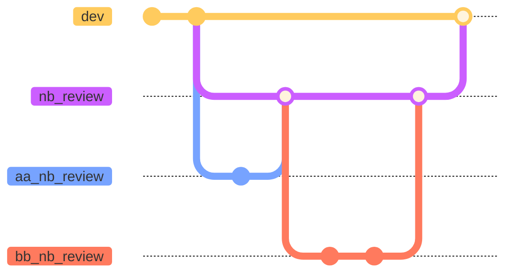

# Guide for performing informal review of Jupyter notebooks

Author: Andrew Laws - USGS Web Informatics and Mapping

Date: 3/15/2023

## Purpose

The purpose of this document is to create a guide for setting up and executing an informal review for Jupyter Notebooks, with an emphasis on Notebooks that serve as tutorials in coding and domain knowledge.

## Informal review process overview

This review process differs slightly from the 'standard' github review mechanism -- we are prescribing the following workflow to minimize the need to work with git and its vagaries.

1. Complete work on Jupyter Notebook and determine no more changes will be made until after review.

2. Identify the kinds of reviews you want done. Some examples are reviews for coding practices and to ensure domain knowledge is correct.

3. Identify individuals who can perform reviews and which kinds of reviews they can perform.

4. Identify platform to perform the review on (laptop/desktop, HPC, Nebari).

5. Write instructions for code review and create GitHub/GitLab issue with instructions. See [Instructions Template](#instructions-template) below for a more in-depth guide. See [Instructions Example (GitHub)](#instructions-example-github) below for a more in-depth guide.

6. Create a new branch to make pull requests from review against. Add this branch to the instructions. The branch process could look like this:

7. Email reviewers with link to GitHub/GitLab issue, the review types for them to complete, and be sure to include review completion date.

8. Upon a reviewer opening a pull request, merge the PR into the notebook review branch. This will likely have merge conflicts that will need to be manually addressed due to the format of Jupyter Notebooks. A more in-depth dive into this is below in [Notebook Merge Conflicts](#notebook-merge-conflicts).

9. After merging all reviews, merge the notebook review branch into the primary branch (main or dev).

## Instructions Template

Sections will be titled in *italics* and inline suggestions will be bolded.

*Topics*

**What follows are the instructions for review and feedback on the notebook "notebook_name.ipynb". The objective of this notebook is as a tutorial for Python users to work with the following topics:**

Review the notebook and pick out 4-7 topics that are important for reviewers to understand when reviewing the notebook.

*Prerequisites to perform review*

**The following are needed for performing this review:**

What platform will the review be performed on and does the reviewere have access? Who does the reviewer contact to get access? Are there any other accounts the reviewer will need to have?

*Instructions to perform review*

This section will lay out the steps to completing the review. Some important steps are:

1. How to create a branch (if a member of repository organization) or fork the project (if not a member).
2. How to setup the environment on the platform the review will be done on. If extra instructions are needed to setup a custom environment, be sure to include an environment YML to do so.
3. How to format feedback in notebook. A common way is "**[first name] comment/edited text/edited code"**.
4. When and how to commit changes and push those changes to origin.

*Review types and descriptions*
Title the review types in bold and add some questions/comments to help the reviewer understand the scope of the type.

*Where/how to submit feedback*

Include instructions on clearing cell outputs, opening a PR with specifics for those who are part of the organization and those who aren't. Include the branch to compare to in the PR, who to assign as a reviewer, and the date to submit feedback by.

## Instructions Example (GitHub)

What follows are the instructions for review and feedback on the notebook "CONUS404_DRB_Data_Prep.ipynb". The objective of this notebook is as a tutorial for newer Python users to work with the following topics:

CONUS404 dataset
exploratory spatial data analysis (ESDA)
data preparation of multiple datasets for comparative analysis, including:
temporal extent and step
geographic extent
parallel computing
accessing data from a variety of sources, including:
cloud storage
API calls
FTP calls
The following are needed for running this notebook:

Access to the [ESIP-Nebari on AWS](https://nebari.esipfed.org/). If you do not have access to this, please email Andrew at alaws@contractor.usgs.gov and he will get you credentials.
Github account (though this can be worked around if need be, just let Andrew know)
Set Up

Navigate to the [hytest-org repo](https://github.com/hytest-org/hytest)
If you are a member of the `hytest-org` GH organization, create a branch into you which your feedback will go -- such as xx-NB-review, where 'xx' is your initials.s
If you are not a member, create a fork of the project. Your steps for project contribution on GH are detailed well in [this guide to contributing to projects](https://docs.github.com/en/get-started/quickstart/contributing-to-projects)
Login to ESIP-QHUB and start a server instance.
Click on the *Git* dropdown from the top navigation bar and select *Clone a repo*. Copy and paste the SSH url from the *hytest-org* repo (or forked repo) into the dialog box and click *Clone*
Informal Review

Navigate to the hytest/dataset_preprocessing/tutorials/CONUS404 folder and open the CONUS404_DRB_Data_Prep.ipynb, selecting the "users-pangeo" kernel when asked.
Based on the review type Andrew has asked you for and any additional you wish to do, use the questions as guidelines for any changes and feedback that you make:
Feedback should be in the format of "[first name] comment/edited text/edited code"
**Code review**
Is the code readable? Do variable names make sense? Are all of the packages and tools used? Are functions adequately explained, including docstrings? Is there unnecessary duplication of code? Is there a more effective way to accomplish what the code does? What needs further explanation?

**Domain review**
Is the correct terminology used? Are variables consistent between datasets, example: are mean temp calculated correctly? Does the notebook take into account what domain experts would know? Are units correct? What needs further explanation?

**Learner review**
Do the learning objectives of the notebook seem clear? Are the sections organized in a way that makes sense? Where are sections that need more instruction or background? Are there sections that are repetitve? to What needs further explanation?

Additionally, feedback on grammar or other thoughts are also welcome.
After adding all comments and suggested changes to the notebook, be sure to clear out all cell outputs. This can be done by clicking on *Kernel* and selecting *Restart kernal and clear all outputs/Clear all outputs*. Next, open a pull request in the [hytest-org repo](https://github.com/hytest-org/hytest) with the target branch of "arl-conus404_nb_review" and assign "alaws-USGS" as the reviewer. For those who forked the repo, follow the directions for [contributing to projects](https://docs.github.com/en/get-started/quickstart/contributing-to-projects) that was used earlier.
Please submit all feedback and changes via pull request by January 20th, 2023. Thank you for your help and if you have any questions, please feel free to contact Andrew.

## Notebook Merge Conflicts

When attempting to merge the branches, there is a high likelihood of merge conflicts. This is due to the structure of Jupyter Notebooks, which is composed largely of text we don't see and can't edit directly. What is seen by the person running the notebook cells are a rendered visualization so changes to a cell may cause issues in the underlying  JSON. Both GitHub and GitLab have write ups for handling merge conflicts. Here is the link to [Github's guide](https://docs.github.com/en/pull-requests/collaborating-with-pull-requests/addressing-merge-conflicts/resolving-a-merge-conflict-using-the-command-line) and here is [GitLab's guide](https://docs.gitlab.com/ee/user/project/merge_requests/conflicts.html).

## Notebook creation and review lifecycle

An example of how this is being done with the CONUS404 forcings tutorial notebooks.

1. Complete data preparation notebook.
2. Send data preparation notebook to reviewers.
3. Complete analysis notebook.
4. Complete data preparatoin notebook review.
5. Send analysis notebook to reviewers.
6. Complete visualization notebook.
7. Complete analysis notebook review.
8. Send and complete visualization notebook review.
