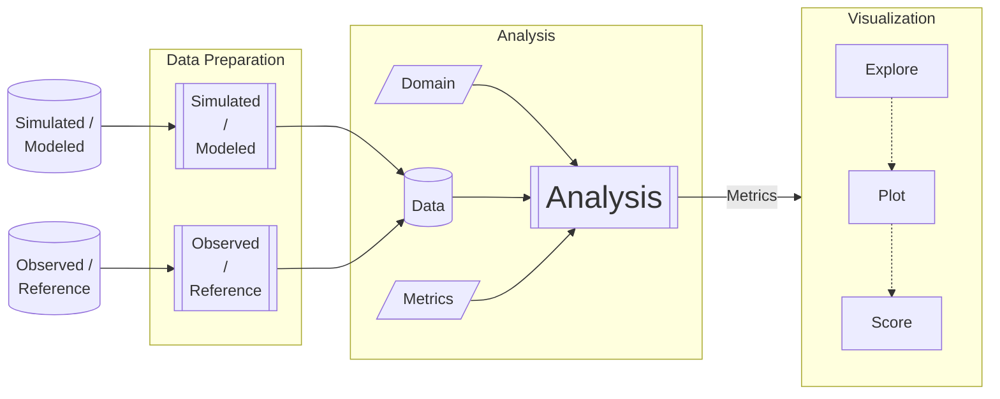

# Model Eval Block Diagram

This is the `mermaid` source used to generate the various model eval diagrams in the `doc/assets` folder. 
This code can be intepreted with markdown or other interpreter, if the documentation system supports
such extensions.  

In our case, we used the online generator at <https://mermaid.live/> to render this code, and the SVG included
in various notebooks across the repo. 

