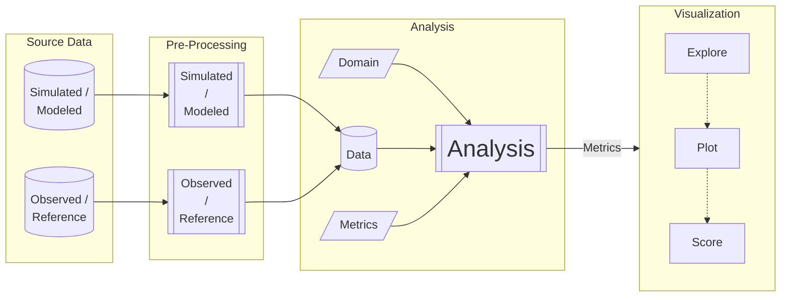

# Model Evaluation Workflow

## Overview

In broad strokes, the evaluation workflow contains these components:

This can be broken down per variable, as there are different reference 
datasets for variables, as well as aggregation methods.  Examples below will 
emphasize _streamflow_, but the principles will apply to other variables as well. 

## Source Data
Source datasets include modeled data (_[NWM](https://registry.opendata.aws/nwm-archive/)_ 
or _NHM_, for example) and a reference dataset 
representing the '_observed_' values covering the same variable and temporal range. For
_streamflow_ data, we have actual gage readings.  For other variables, we have other standard
datasets representing the "reality" against which the model will be compared. 

Source datasets are found in a variety of storage mechanisms.  The main mechanisms that we 
need to be able to accomodate are: 
* '_on-prem_' data stored on `/caldera`, accessible by one of the HPC hosts. 
* Object storage in the '_cloud_' -- typically an [S3 bucket](/dev/null) in the AWS cloud computing ecosystem. 
* [API request](/dev/null) -- data is offered by a provider as a network service.  An **A**plication **P**rogramming **I**nterface call is made from within a python
program to fetch the data from the network provider. This is typically via 
_http_ or _ftp_ transfer protocols. 

The source datasets may be replecated among two or more of these access methods.  Which to
use may depend on where the processing takes place (i.e. if running a notebook on `denali` or 
`tallgrass`, _on-prem_ data is preferred over S3;  if running on a cloud environment (esip/qhub), 
S3 is preferred.)

## Pre-Processing
The pre-processing step is needed in order to rectify the data and organize it in preparation
for analysis.  Rectifying the data includes measures such as: 
* Organizing the time-series index according to the same time step for both _simulated_ and _observed_;
* Coordinate aggregation units between _simulated_ and _observed_
* Re-Chunking the data to make time-series analysis more efficient (see [here](/dev/null) for a primer on re-chunking)

At this stage, a given variable should be represented as a pair of 2D array of values (one
for _simulated_, one for _observed_).  
One dimension of the array is indexed by some nominal data field ('_gage_id_', '_HUC-12_ ID', 
etc), while the other dimension is indexed by time step.

## Analysis
The above data organization steps will allow us to pull a time-series for a given station
from both the _simulated_ and _observed_ datasets, and run a series of statistical metrics
against these values to evaluate Goodness Of Fit (GOF).  Benchmarking proceeds
according tothis general recipe: 

1) A set of predictions and matching observations (i.e. the **data**, established above); 
2) The **domain** (e.g. space or time) over which to benchmark
   * This will vary by variable and by dataset.  For _streamflow_, the list 
     of 'cobalt' gages ([Foks et al., 2022](https://doi.org/10.5066/P972P42Z))
     establishes the spatial domain identifying which gages to consider. 
   * Other variables will have other definitions for domain, which restrict
     analysis to a specific set of locations or times.
3) A set of statistical **metrics** with which to benchmark. 
   * The specific metrics to calculate.
   * _Is this variable-specific??_

The end result of this analysis is a 2D table of values.  One dimension of
this array/table is the same nominal data field (i.e. '_gage_id_'), the other
dimension being the metrics comparing observed vs simulated for that gage. 
It is this table of values that we send to the visualization step. 

## Vizualization
Visualization steps offer different views of the metrics, plotted in various
ways to allow for exploration.  In addition to these interactive visualizations,
a [score card](/dev/null) is offered as a way of summarizing how well the
model compares against the reference dataset. 
